# 录井小雪 Skill Dependency Graph（2026-08-22 — Phase 2.5 修订版）

> 本图基于 `packages/opencode/src/agent/agent.ts`、`xiaoxue-router.ts`、`router.md`、`router.ts`、
> `skills.yaml`、`.opencode/skills/**/SKILL.md` 的实际引用关系生成。
> **Phase 2.5 修订**：在 Phase 2 报告（79 条 / 5 层）基础上，补齐 `mud-logging-report-generation`、
> `tender-bid-generation`、`起草合同` 三个 L0 入口；同时将 `github-ai-trends` 加入 ZOMBIE 分类，
> 确立 **80 条 / 7 层** 的 canonical universe。
> 颜色说明：🔴 L0 核心入口 / 🟢 L1 专业常用 / 🟣 L2 基础底座 / ⚫ L3 内部归并 / ⚪ L4 暂禁 / ◽ L4 真归档 / ⬛ ZOMBIE。
> 配套数据：[skill-dependency-matrix-2026-08-22.tsv](skill-dependency-matrix-2026-08-22.tsv)（80 行 × 13 列，含 `node_source` 列）。
> **Phase 3.0A 对账（2026-08-23，superseded by Phase 3.0A）**：ZOMBIE 分类维持三个 —— `contract-management` /
> `github-ai-trends` / `llm-wiki`（磁盘均无 SKILL.md，仅残留文件）；`mud-logging-review` **不属于 ZOMBIE**，
> 已在 Phase 3.0 迁移至 `.opencode/.archive/`，终态 `DEPRECATED_MIGRATED`。
> 详见 [phase3.0a-closeout-reconciliation-2026-08-23.md](phase3.0a-closeout-reconciliation-2026-08-23.md)。

```mermaid
graph TB
  classDef l0 fill:#ff6b6b,stroke:#fff,stroke-width:3px,color:#fff
  classDef l1 fill:#4ecdc4,stroke:#fff,stroke-width:2px,color:#fff
  classDef l2 fill:#a29bfe,stroke:#fff,stroke-width:1px,color:#fff
  classDef l3 fill:#95a5a6,stroke:#fff,stroke-width:1px,color:#fff
  classDef l4d fill:#dfe6e9,stroke:#636e72,stroke-dasharray: 5 5
  classDef l4a fill:#b2bec3,stroke:#2d3436,stroke-dasharray: 8 4
  classDef zombie fill:#2c3e50,stroke:#e74c3c,stroke-width:4px,color:#fff

  %% ============ L0 核心入口 (8) ============
  subgraph L0["L0 核心入口（8 个）"]
    L0_OFFICE["office-assistant<br/>日常办公主入口"]:::l0
    L0_GEOLOG["geolog-logging-review<br/>地质录井报告审核"]:::l0
    L0_MUDGEN["mud-logging-report-generation<br/>地质录井报告生成"]:::l0
    L0_GEOKNOW["geology-knowledge<br/>企业知识查询"]:::l0
    L0_TENDER_R["tender-document-review<br/>标书审核"]:::l0
    L0_TENDER_G["tender-bid-generation<br/>标书生成"]:::l0
    L0_REVIEW["审查合同<br/>合同审核"]:::l0
    L0_DRAFT["起草合同<br/>合同起草"]:::l0
  end

  %% ============ L1 专业常用 (10) ============
  subgraph L1["L1 专业常用（10 个）"]
    L1_MATORG["material-organizer<br/>资料整理"]:::l1
    L1_ESIGN["tencent-esign-contract<br/>腾讯电子签"]:::l1
    L1_WIKI["llm-wiki-knowledge<br/>Wiki 管理"]:::l1
    L1_WELL["well-control-risk-assessment<br/>井控风险 FUTURE"]:::l1
    L1_TENDMGT["tender-management<br/>招标方视角"]:::l1
    L1_TM["tencent-meeting-skill<br/>腾讯会议"]:::l1
    L1_DOCREV["document-review-tracked<br/>留痕审稿"]:::l1
    L1_AIHOT["aihot<br/>AI 资讯"]:::l1
    L1_DR["deep-research<br/>深度研究"]:::l1
    L1_DISTILL["knowledge-distill<br/>知识蒸馏 (user_visible=no)"]:::l1
  end

  %% ============ L2 FOUNDATION (13) ============
  subgraph L2["L2 基础底座（13 个，user_visible=no）"]
    F_MD["markitdown-skill"]:::l2
    F_DOCX["minimax-docx"]:::l2
    F_XLSX["minimax-xlsx"]:::l2
    F_PDF["pdfkit-py"]:::l2
    F_WPS["wpscli"]:::l2
    F_OCR["tencentcloud-ocr"]:::l2
    F_WHISPER["openai-whisper-api"]:::l2
    F_WEB["web-access"]:::l2
    F_BROWSER["browser-use"]:::l2
    F_OBS["obsidian"]:::l2
    F_PPTX["pptx-generator"]:::l2
    F_OIL["石油行业合同知识库"]:::l2
    F_ITC["信息化建设工具箱"]:::l2
  end

  %% ============ L3 内部归并 (16) ============
  subgraph L3["L3 内部 / 归并候选（16 个）"]
    L3_LDW["long-document-writing"]:::l3
    L3_MMM["meeting-minutes-manager"]:::l3
    L3_HUMAN["humanizer"]:::l3
    L3_LIAB["合同台账提醒"]:::l3
    L3_NEGO["谈判备忘整理"]:::l3
    L3_SUP_IR["supervision-issue-report"]:::l3
    L3_SUP_DOC["supervision-doc-check"]:::l3
    L3_SUP_CASE["supervision-case-collector"]:::l3
    L3_SUP_PHOTO["supervision-photo-check"]:::l3
    L3_SUP_STD["supervision-standard-lookup"]:::l3
    L3_NDA["NDA快筛"]:::l3
    L3_COMP["合同对比"]:::l3
    L3_COMPLY["合规性检查"]:::l3
    L3_LAW["法条速查"]:::l3
    L3_ECON["条款经济影响评估"]:::l3
    L3_MUDREV["mud-logging-review<br/>英文版<br/>(Phase 3.0A: DEPRECATED_MIGRATED → .archive/)"]:::l3
  end

  %% ============ L4 暂禁 (19) ============
  subgraph L4D["L4 暂禁 FOR XIAOXUE（19 个）"]
    L4_AUTO["autoresearch"]:::l4d
    L4_IMG["image-well"]:::l4d
    L4_NANO["nano-banana-pro"]:::l4d
    L4_PROMPT["prompt-engineering-expert"]:::l4d
    L4_SELF["yourself-skill"]:::l4d
    L4_COG["cognitive-profile"]:::l4d
    L4_FULL["fullstack-dev"]:::l4d
    L4_DARWIN["darwin-skill"]:::l4d
    L4_TUTOR["tutor-skills"]:::l4d
    L4_GH["github"]:::l4d
    L4_GHCN["github-trending-cn"]:::l4d
    L4_BENCH["标杆对比"]:::l4d
    L4_TECH["技术选型评审"]:::l4d
    L4_PROJ["立项报告"]:::l4d
    L4_WRITE["写报告"]:::l4d
    L4_DESK["桌面调研"]:::l4d
    L4_FRAME["方案框架"]:::l4d
    L4_WEEK["项目周报"]:::l4d
    L4_LEAD["领导汇报"]:::l4d
  end

  %% ============ L4 真归档 (11) ============
  subgraph L4A["L4 真归档候选（11 个，与业务无关）"]
    A_EFFECT["effect"]:::l4a
    A_EXP["experiment-design"]:::l4a
    A_BASE["research-baseline-builder"]:::l4a
    A_PAPER["giiisp-paper-search-apis"]:::l4a
    A_PCHK["papercheck"]:::l4a
    A_MANIM["manim-agent"]:::l4a
    A_COURSE["practical-course-producer"]:::l4a
    A_SCI["sci-employee-deep-research"]:::l4a
    A_PDF["minimax-pdf"]:::l4a
    A_SC["skill-criticagent"]:::l4a
    A_MCP["mcp-criticagent"]:::l4a
  end

  %% ============ ZOMBIE (3) ============
  subgraph Z["ZOMBIE_CLEANED_FROM_ALLOWLIST（3 个）"]
    Z_CM["contract-management<br/>仅 references/"]:::zombie
    Z_GHAT["github-ai-trends<br/>仅 _skillhub_meta.json + scripts/"]:::zombie
    Z_LLMW["llm-wiki<br/>仅 _skillhub_meta.json"]:::zombie
  end

  %% ===== L0 内部关系（8 个核心入口的协作） =====
  L0_TENDER_R <-.->|"互补"| L0_TENDER_G
  L0_REVIEW <-.->|"起草+审核双向"| L0_DRAFT
  L0_GEOLOG <-.->|"知识共享"| L0_GEOKNOW
  L0_MUDGEN -.->|"生成 + 审核配对"| L0_GEOLOG
  L0_OFFICE -.->|"材料→审核"| L0_REVIEW

  %% ===== L0 → L1（专业子能力调用） =====
  L0_OFFICE ==>|"默认开启"| L1_MATORG
  L0_OFFICE ==>|"按任务调用"| L1_TM
  L0_OFFICE ==>|"按任务调用"| L1_DOCREV
  L0_OFFICE -.->|"专业模式"| L1_DISTILL
  L0_GEOLOG ==>|"按需"| L1_DOCREV
  L0_GEOKNOW ==>|"查询-蒸馏-维护"| L1_DISTILL
  L0_GEOKNOW ==>|"查询-蒸馏-维护"| L1_WIKI
  L0_GEOKNOW ==>|"按需"| L1_AIHOT
  L0_GEOKNOW ==>|"按需"| L1_DR
  L0_TENDER_R ==>|"招标方视角"| L1_TENDMGT
  L0_TENDER_G ==>|"自描述"| L1_TENDMGT
  L0_REVIEW ==>|"外部服务"| L1_ESIGN
  L0_DRAFT -.->|"未来可能"| L1_ESIGN

  %% ===== L0 → L2（基础底座使用） =====
  L0_OFFICE ==>|"FOUNDATION"| F_DOCX
  L0_OFFICE ==>|"FOUNDATION"| F_XLSX
  L0_OFFICE ==>|"FOUNDATION"| F_PPTX
  L0_OFFICE ==>|"FOUNDATION"| F_MD
  L0_OFFICE ==>|"FOUNDATION"| F_WHISPER
  L0_GEOLOG ==>|"FOUNDATION"| F_MD
  L0_GEOLOG ==>|"FOUNDATION"| F_PDF
  L0_GEOLOG ==>|"FOUNDATION"| F_OCR
  L0_MUDGEN ==>|"FOUNDATION"| F_PDF
  L0_MUDGEN ==>|"FOUNDATION"| F_OCR
  L0_TENDER_R ==>|"FOUNDATION"| F_MD
  L0_TENDER_R ==>|"FOUNDATION"| F_PDF
  L0_REVIEW ==>|"FOUNDATION"| F_OIL
  L0_DRAFT ==>|"FOUNDATION"| F_DOCX

  %% ===== L0 → L3（被 L0 显式路由的内部子任务） =====
  L0_OFFICE ==>|"router.md:13"| L3_LDW
  L0_OFFICE ==>|"router.md:10"| L3_MMM
  L0_OFFICE ==>|"router.ts:134"| L3_HUMAN
  L0_OFFICE ==>|"router.md:20"| L3_LIAB
  L0_GEOLOG -.->|"100% 重复"| L3_MUDREV

  %% ===== L1 → L2（专业子能力对底座的使用） =====
  L1_WIKI ==>|"FOUNDATION"| F_OBS
  L1_DR ==>|"FOUNDATION"| F_WEB
  L1_AIHOT ==>|"FOUNDATION"| F_WEB
  L1_DOCREV ==>|"FOUNDATION"| F_MD
  L1_TM ==>|"FOUNDATION"| F_WHISPER
  L1_DISTILL -.->|"查询"| L1_WIKI

  %% ===== L3 内部关系（监督类合并 5→1） =====
  L3_SUP_CASE <-.->|"合并 4→1"| L3_SUP_PHOTO
  L3_SUP_CASE <-.->|"合并 4→1"| L3_SUP_STD
  L3_SUP_CASE <-.->|"合并 4→1"| L3_SUP_IR
  L3_SUP_CASE <-.->|"部分重叠"| L3_SUP_DOC

  %% ===== L3 → L2（内部归并 Skill 的底座依赖） =====
  L3_MMM ==>|"FOUNDATION"| F_MD
  L3_MMM ==>|"FOUNDATION"| F_WHISPER
  L3_SUP_PHOTO ==>|"FOUNDATION"| F_OCR

  %% ===== 归并方向（粗体边 = canonical 目标） =====
  L3_LDW ==>|"MERGE"| L0_OFFICE
  L3_MMM ==>|"MERGE"| L0_OFFICE
  L3_HUMAN ==>|"MERGE"| L0_OFFICE
  L3_LIAB ==>|"MERGE"| L0_OFFICE
  L3_NEGO ==>|"MERGE"| L0_OFFICE
  L3_SUP_IR ==>|"MERGE"| L0_OFFICE
  L3_SUP_DOC ==>|"MERGE"| L0_GEOLOG
  L3_SUP_PHOTO ==>|"MERGE"| L3_SUP_CASE
  L3_SUP_STD ==>|"MERGE"| L3_SUP_CASE
  L3_SUP_CASE ==>|"MERGE 5→1"| L1_DOCREV
  L3_NDA ==>|"MERGE"| L0_REVIEW
  L3_COMP ==>|"MERGE"| L0_REVIEW
  L3_COMPLY ==>|"MERGE"| L0_REVIEW
  L3_LAW ==>|"MERGE"| L0_REVIEW
  L3_ECON ==>|"MERGE"| L0_REVIEW
  L3_MUDREV ==o|"canonical only 不删除"| L0_GEOLOG

  %% ===== ZOMBIE 重定向 =====
  Z_CM -.->|"已重定向到 起草合同/审查合同"| L0_DRAFT
  Z_CM -.->|"已重定向到 审查合同"| L0_REVIEW
  Z_GHAT -.->|"已重定向到 github-trending-cn"| L4_GHCN
  Z_LLMW -.->|"已重定向到 llm-wiki-knowledge"| L1_WIKI

  %% ===== L4 自我说明 =====
  L4_BENCH <-.->|"关联但暂禁"| L4_TECH
  L4_PROJ <-.->|"关联但暂禁"| L4_WRITE
  L4_FULL <-.->|"关联但暂禁"| A_SC
  L4_DARWIN <-.->|"关联但暂禁"| A_SC
  A_MANIM <-.->|"关联但暂禁"| A_COURSE
  A_SCI <-.->|"80% 重复"| L1_DR
```

## 节点统计（与 TSV 完全一致）

| 分类 | 节点数 | 颜色 | 备注 |
| --- | --- | --- | --- |
| L0_CORE_ENTRY 核心入口 | 8 | 🔴 红 | 用户直接可见；Phase 2.5 从 5 扩到 8 |
| L1_SPECIALIST 专业常用 | 10 | 🟢 青 | 保留为专业子能力；Phase 2.5 从 12 缩到 10（3 个升 L0，1 个 L1 中 3 个去重） |
| L2_FOUNDATION 基础底座 | 13 | 🟣 紫 | 不对用户直接展示，user_visible=false |
| L3_INTERNAL 内部归并 | 16 | ⚫ 灰 | MERGE 候选，保留目录与 SKILL.md |
| L4_DISABLED_FOR_XIAOXUE 暂禁 | 19 | ⚪ 灰虚 | Phase 3+ 决定是否启用 |
| L4_TRUE_ARCHIVE_CANDIDATE 真归档 | 11 | ◽ 灰虚深 | 与录井业务无关，可直接 `.archive/` |
| ZOMBIE_CLEANED 僵尸 | 3 | ⬛ 黑红 | allowlist 已清理，目录保留以备追溯 |
| **合计** | **80** | | 与 `skill-dependency-matrix-2026-08-22.tsv` 80 行一一对应 |

## Phase 2.5 关键变更（与上一版对比）

| 维度 | Phase 2（修订前） | Phase 2.5（当前） | 变更原因 |
| --- | --- | --- | --- |
| L0 入口数 | 5 | **8** | 新增 `mud-logging-report-generation` / `tender-bid-generation` / `起草合同` 为 L0 |
| L1 专业常用 | 12 | **10** | 3 个升 L0；新增 `knowledge-distill`（user_visible=no） |
| L2 基础底座 | 12 | **13** | 复核后保持一致；`pptx-generator` 留 FOUNDATION |
| L3 内部归并 | 16 | **16** | 数量不变；明确 5→1 监督类归并 |
| L4 暂禁 + 真归档 | 32（合并） | **19 + 11 = 30** | 拆分为 L4_DISABLED_FOR_XIAOXUE 与 L4_TRUE_ARCHIVE_CANDIDATE |
| ZOMBIE | 2 | **3** | 增补 `github-ai-trends`（router.ts:40 已重定向） |
| 合计 | 79 | **80** | 增补 `github-ai-trends` 显式 ZOMBIE 项 |
| 列定义 | 12 列 | **13 列** | 增 `node_source` 列（`physical_SKILL_md` vs `configured_only_skill_id_no_SKILL_md`） |

## 高风险引用边（🔴 虚线 / 🟡 重点）

1. `contract-management` → `起草合同` / `审查合同` —— router.ts:137 / router.md:18 / skills.yaml:57 / 两个测试 **本阶段已全部修复**（phase25-2a/b/c）
2. `github-ai-trends` → `github-trending-cn` —— router.ts:40 **已重定向**（phase25-2d）
3. `llm-wiki` → `llm-wiki-knowledge` —— router.ts:118 / skills.yaml:88 / 两个测试 **本阶段已全部修复**（phase25-2d）
4. `mud-logging-review` → `geolog-logging-review` —— 100% 重复；本阶段**仅确定 canonical，不删除目录**
5. `meeting-minutes-manager` → `office-assistant` 任务模板 —— 高度重叠，trigger 冲突，Phase 3 合并
6. `humanizer` → `office-assistant` 润色任务 —— 完全重叠，Phase 3 合并
7. `tencent-esign-contract` ↔ `审查合同` —— description 级 trigger 冲突（"审查合同"、"合同风险"等触发词重复），需 SKILL.md 门控

## 文件来源

- `packages/opencode/src/agent/agent.ts`（7 个 Agent 的 Skill allowlist，本阶段已修改 4 处：起草合同 / 合同台账提醒 / 移除 contract-management）
- `packages/opencode/src/agent/xiaoxue-router.ts`（已拆分 contract-management 为 4 条细粒度规则）
- `configs/xiaoxue/router.md`（line 18 已改；line 25 已加 llm-wiki-knowledge）
- `configs/xiaoxue/skills.yaml`（line 57 已改；line 88 已改）
- `packages/opencode/test/portable-skills.test.ts`（line 23, 80 已改）
- `packages/opencode/test/xiaoxue-router.test.ts`（line 39, 67 已改）
- `.opencode/skills/**/SKILL.md`（77 个 Skill 的 frontmatter 与正文）
- `docs/skill-center/skill-dependency-matrix-2026-08-22.tsv`（80 行 × 13 列 canonical 清单）
